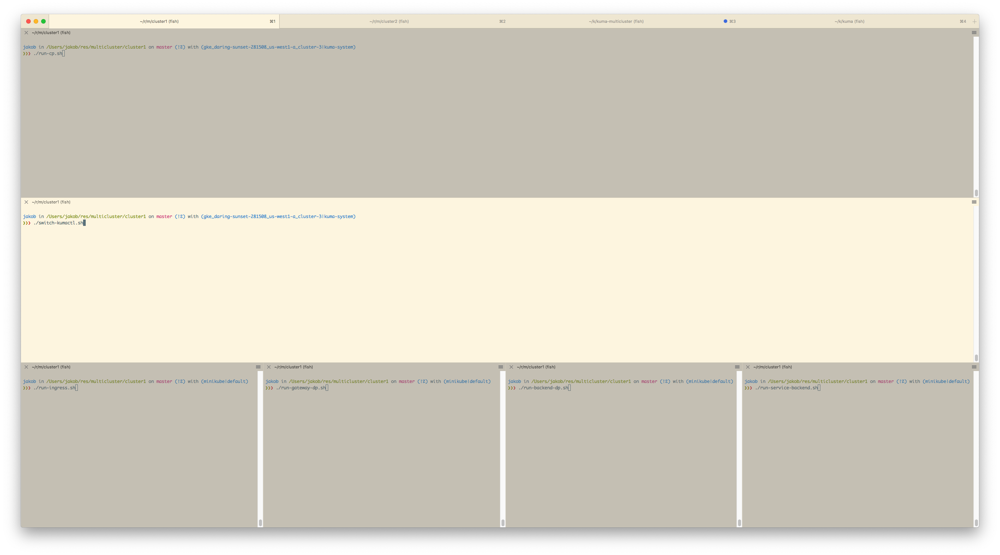

# Kuma Multicluster Universal Demo

## Requirements
* Make sure `kuma-cp`, `kuma-dp` and `kumactl` is on the PATH
* Run `install-ctl-config.sh` (We have a validation that control plane is running before adding it to kumactl, so I copy the config instead of executing commands to add it)

## Architecture

### Cluster 1

**Control Plane**
Control Plane listens on standard ports prefixed by "1" (15681 for API etc.)

**Dataplanes**
* Gateway (without Kong, just DP with outbound on 10005 that communicates with "backend")
* Ingress (on port 10000. Not used for communication right now since cluster 2 does not communicate with cluster 1. Added for test syncing)
* Backend-01 (service: backend, version: 1). Inbound on 10010, service on 10011.
  Backend Service - simple python HTTP server

### Cluster 2

**Control Plane**
Control Plane listens on standard ports prefixed by "2" (25681 for API etc.)

**Dataplanes**
* Ingress (on port 20000)
* Backend-02 (service: backend, version: 2). Inbound on 20012, service on 20013.
  Backend Service - simple python HTTP server
* Backend-03 (service: backend, version: 1). Inbound on 20010, service on 20011.
  Backend Service - simple python HTTP server

### Global

**Control Plane**
Control Plane listens on standard ports prefixed by "3" (35681 for API etc.)

## Instruction

### Setup
I recommend running every cluster in tab and components in panes (cmd+D, cmd+shift+D is your friend)



in `global` directory
1. Run Global `./run-cp.sh`

in `cluster1` directory
1. Run CP in cluster 1 `./run-cp.sh`
2. Run ZoneIngress in cluster 1 `./run-ingress.sh`
3. Run Gateway in cluster 1 `./run-gateway-dp.sh`
4. Run Backend DP in cluster 1 `./run-backend-dp.sh`
5. Run Service for Backend DP in cluster 1 `./run-service-backend.sh`

(at this point you can do `../requests-through-gateway.sh` to see that you've got communication)

in `cluster2` directory
1. Run CP in cluster 2 `./run-cp.sh`
2. Run ZoneIngress in cluster 2 `./run-ingress.sh`
3. Run Backend DP in cluster 2 `./run-backend-dp-02.sh`
4. Run Service for Backend DP in cluster 1 `./run-service-backend-02.sh`
5. Run Backend DP in cluster 2 `./run-backend-dp-03.sh`
6. Run Service for Backend DP in cluster 1 `./run-service-backend-03.sh`

in `global` directory
1. Inspect dataplanes
```
❯❯❯ ./switch-kumactl.sh && kumactl get dataplanes
switched active Control Plane to "global"
MESH      NAME                   TAGS                                                       AGE
default   cluster-1.backend-01   kuma.io/service=backend kuma.io/zone=cluster-1 version=1   8m
default   cluster-1.gateway-01   kuma.io/service=gateway kuma.io/zone=cluster-1             8m
default   cluster-2.backend-02   kuma.io/service=backend kuma.io/zone=cluster-2 version=2   1m
default   cluster-2.backend-03   kuma.io/service=backend kuma.io/zone=cluster-2 version=1   38s
```
(you can do the same on other clusters to see that ingresses are synced)

2. Deploy mTLS: `./switch-kumactl.sh && kumactl apply -f mesh.yaml` 
   (you can go to other clusters and do `./switch-kumactl.sh && kumactl get meshes -oyaml` etc. to see that resources are synced)
   Ingresses require mTLS to work.

### Use cases

in global

0. Switch kumactl in global `./switch-kumactl.sh`

#### Load balancing across all the clusters
1. Let's now make some requests via Gateway in Cluster 1 with `../requests-through-gateway.sh`
   Requests should be loadbalanced between all backends in every cluster!

#### Load balancing to cluster 2
1. Apply TrafficRoute to redirect all traffic from gateway to backend to cluster 2 `kumactl apply -f tr-all-to-cluster2.yaml`
2. Make some requests `../requests-through-gateway.sh`
   All the requests are passed to the cluster 2!
3. Remove traffic route `kumactl delete traffic-route tr-all-to-cluster2`

### Load balancing to version 2 which is only available in cluster 2
1. Apply TrafficRoute to version 2 which only exist in cluster 2: `kumactl apply -f tr-version-2.yaml`
2. Make some requests `../requests-through-gateway.sh`
   All the requests are passed to the version 2!
3. Remove traffic route `kumactl delete traffic-route tr-version-2`

### Cross Cluster High Availability
1. Apply Health Check from gateway to backend `kumactl apply -f hc.yaml` (active HC, on Kubernetes this is not needed, since Pod and Dataplane will be just deleted)
2. Stop the service in the cluster 1 (service is enough, DP can stay as is)
3. Make some requests `../requests-through-gateway.sh`
   All the requests are successful (unhealthy instance is ignored)

## Notes
* Check what was changed in the CP config by executing `diff reference-config.yaml cluster1/kuma-cp.yaml`

## TODO
