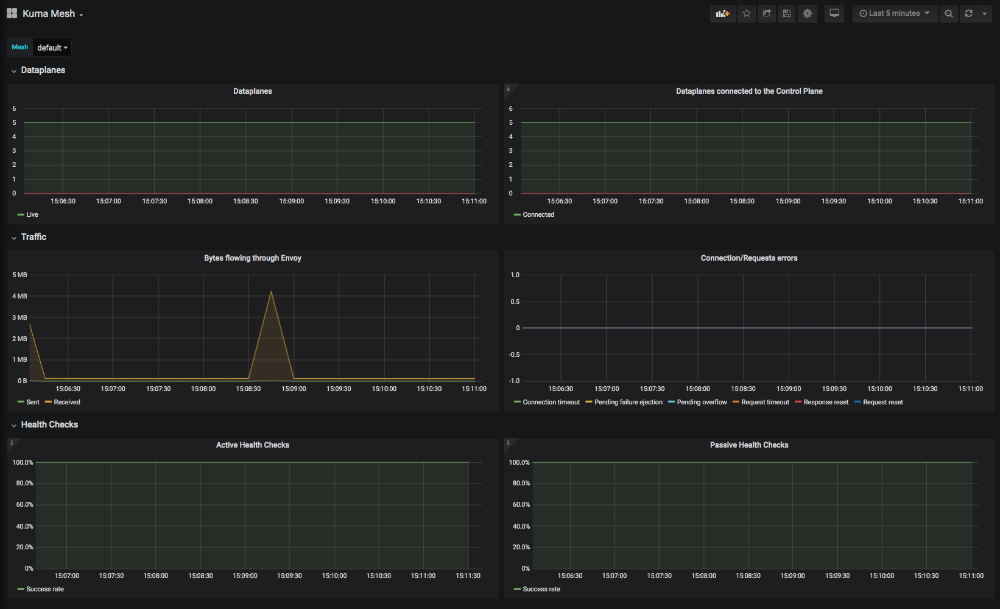
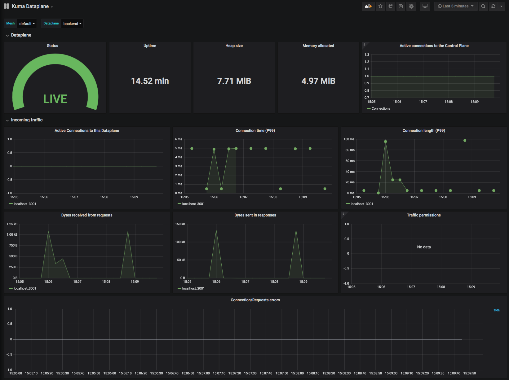

# Universal Deployment Guide

## Introductions

In this repository, you will find the necessary files and instruction to get Kuma up and running in universal mode via Vagrant.

When running in universal mode, there are two ways to store Kuma's state: in-memory or PostgreSQL. The first option stores all the state in-memory. This means that all data will be deleted on restart. This mode is only recommended for use when running locally. The second option is to utilize a PostgreSQL database to store state.The PostgreSQL database and schema will have to be initialized according to the installation instructions.

For the purposes of this demo we will use in-memory.

## Table of contents

- [Universal Deployment Guide](#universal-deployment-guide)
  - [Introductions](#introductions)
  - [Table of contents](#table-of-contents)
  - [Setup Environment](#setup-environment)
    - [Vagrant](#vagrant)
    - [Marketplace application](#marketplace-application)
    - [Kuma](#kuma)
  - [Tools](#tools)
    - [kumactl](#kumactl)
      - [Setup](#setup)
      - [Inspect](#inspect)
    - [GUI](#gui)
  - [Integrations](#integrations)
    - [Kong Gateway](#kong-gateway)
      - [Installation](#installation)
      - [Configure and Start Kong](#configure-and-start-kong)
      - [Configure Dataplane with Gateway mode](#configure-dataplane-with-gateway-mode)
    - [Prometheus](#prometheus)
    - [Grafana](#grafana)
  - [Policies](#policies)
    - [mTLS](#mtls)
      - [Check for mTLS](#check-for-mtls)
      - [Adding mTLS Policy](#adding-mtls-policy)
    - [Traffic Permissions](#traffic-permissions)
      - [Adding Granular Traffic Permissions](#adding-granular-traffic-permissions)
    - [Traffic Routing](#traffic-routing)
      - [Adding Routing Policy](#adding-routing-policy)
    - [Health Check](#health-check)
      - [Adding Health Check Policy](#adding-health-check-policy)
    - [Traffic Metrics](#traffic-metrics)
      - [Adding Traffic Metric Policy](#adding-traffic-metric-policy)
      - [Query Metrics](#query-metrics)
      - [Visualize Metrics](#visualize-metrics)
    - [Fault Injection](#fault-injection)
      - [Adding Fault Injection Policy](#adding-fault-injection-policy)

## Setup Environment

### Vagrant

We'll be using Vagrant to deploy our application and demonstrate Kuma's capabilities in universal mode. Please follow Vagrant's [installation guide](https://www.vagrantup.com/intro/getting-started/install.html) to have it set up correctly before proceeding.

### Marketplace application

Run the following command to run the sample marketplace application via the [Vagrantfile](/vagrant/Vagrantfile) provided in this repository:

```bash
$ vagrant up
```

This will start our demo marketplace application and Kuma split across multiple machines:

1. The first machine hosts the Kuma control plane.
2. The second machine will host Redis service that stores reviews for each item
3. The third machine will host the PostgreSQL service that stores all the items in our marketplace
4. The fourth machine will host the Prometheus dashboard and the [kuma-prometheus-sd](https://kuma.io/docs/latest/policies/#traffic-metrics)
5. The fifth machine will host our v0 backend application that handles the logic of our application
6. The sixth machine will host our v1 backend application that handles the logic of our application with sales
7. The seventh machine will host our frontend application that allows you to visually interact with the marketplace
8. The last machine will be the Kong Gateway acting as an ingress to your mesh

To check if the machines are up and running after the `vagrant up` command, use `vagrant status`:

```bash
$ vagrant status
Current machine states:

kuma-control-plane        running (virtualbox)
redis                     running (virtualbox)
postgresql                running (virtualbox)
prometheus                running (virtualbox)
backend                   running (virtualbox)
backend-v1                running (virtualbox)
frontend                  running (virtualbox)
kong                      running (virtualbox)

This environment represents multiple VMs. The VMs are all listed
above with their current state. For more information about a specific
VM, run `vagrant status NAME`.
```

To shop at Kuma's marketplace, access the Kong gateway that is the ingress to your mesh at [http://192.168.33.70:8000](http://192.168.33.70:8000). All the traffic between the machines are routed through Kuma's data plane proxy.

### Kuma

If you want to learn more about the installation process, please check out [Kuma's official installation page](https://kuma.io/install) to see all the installation methods. For simplicity, run the following script to automatically detect the operating system and download Kuma:

```bash
$ curl -L https://kuma.io/installer.sh | sh -
  % Total    % Received % Xferd  Average Speed   Time    Time     Time  Current
                                 Dload  Upload   Total   Spent    Left  Speed
100  2902  100  2902    0     0   3422      0 --:--:-- --:--:-- --:--:--  3418

INFO	Welcome to the Kuma automated download!
INFO	Fetching latest Kuma version..
INFO	Kuma version: 0.7.2
INFO	Kuma architecture: amd64
INFO	Operating system: darwin
INFO	Downloading Kuma from: https://kong.bintray.com/kuma/kuma-0.7.2-darwin-amd64.tar.gz

  % Total    % Received % Xferd  Average Speed   Time    Time     Time  Current
                                 Dload  Upload   Total   Spent    Left  Speed
  0     0    0     0    0     0      0      0 --:--:-- --:--:-- --:--:--     0
100 49.8M  100 49.8M    0     0  11.1M      0  0:00:04  0:00:04 --:--:-- 14.7M

INFO	Kuma 0.7.2 has been downloaded!

Welcome to Kuma!

===============================================================================

This folder contains your download of Kuma:

├── NOTICE
├── README
├── bin
│   ├── envoy
│   ├── kuma-cp
│   ├── kuma-dp
│   ├── kuma-prometheus-sd
│   └── kumactl
└── conf
    └── kuma-cp.conf.yml

===============================================================================

To get started with Kuma you can take a look at the official documentation:

* Documentation: https://kuma.io/docs
* Slack Chat: https://kuma.io/community

KUBERNETES:

If you are installing Kuma on Kubernetes, run the following command:

$ kumactl install control-plane | kubectl apply -f -

UNIVERSAL:

If you are installing Kuma on other platforms, just run:

$ kuma-cp run

In Universal Kuma runs with the in-memory backend by default. To use Postgres
instead please read the docs:

* https://kuma.io/docs/latest/documentation/backends/

NEXT STEPS:

You can now explore the Kuma GUI on port 5681/gui!

Finally, you can start using Kuma by apply traffic policies to any service
running in your system:

* https://kuma.io/policies/
```

Next, navigate into the `kuma-0.7.2/bin` directory where the kuma components will be:

```bash
$ cd kuma-0.7.2/bin && ls
envoy              kuma-dp            kumactl
kuma-cp            kuma-prometheus-sd
```

## Tools

### kumactl

The `kumactl` application is a CLI client for the underlying HTTP API of Kuma. Therefore, you can access the state of Kuma by leveraging with the API directly. In universal mode you will be able to also make changes via the HTTP API, while in Kubernetes mode the HTTP API is read-only.

**Throughout this guide, you will be using `kumactl apply [..]` frequently so make sure you have this configured properly. If you need to download it, checkout the [Kuma](#kuma) step above.**

#### Setup

You can configure `kumactl` to point to any remote kuma-cp instance. Configure your local `kumactl` to point to our Vagrant machine by running:

```bash
$ ./kumactl config control-planes add --name=vagrant --address=http://192.168.33.10:5681
added Control Plane "vagrant"
switched active Control Plane to "vagrant"
```

#### Inspect

Once `kumactl` is pointing to the correct control-plane, you can use it to inspect the data plane proxies in the mesh.

```bash
$ ./kumactl inspect dataplanes
MESH      NAME         TAGS                                                       STATUS   LAST CONNECTED AGO   LAST UPDATED AGO   TOTAL UPDATES   TOTAL ERRORS   CERT REGENERATED AGO   CERT EXPIRATION   CERT REGENERATIONS
default   backend      kuma.io/protocol=http kuma.io/service=backend version=v0   Online   19m                  19m                3               0              never                  -                 0
default   backend-v1   kuma.io/protocol=http kuma.io/service=backend version=v1   Online   17m                  17m                3               0              never                  -                 0
default   frontend     kuma.io/protocol=http kuma.io/service=frontend             Online   15m                  15m                3               0              never                  -                 0
default   kong         kuma.io/service=kong                                       Online   12m                  12m                3               0              never                  -                 0
default   postgresql   kuma.io/service=postgresql                                 Online   22m                  22m                2               0              never                  -                 0
default   redis        kuma.io/service=redis                                      Online   24m                  24m                2               0              never                  -                 0
```

There are 6 data plane proxies.

### GUI

Kuma ships with an internal GUI that will help you visualize the mesh and its policies in an intuitive format. It can be found on port `:5681` on the control-plane machine. Since our Kuma control-plane machine's IP is `192.168.33.10`, navigate to [http://192.168.33.10:5681/gui](http://192.168.33.10:5681/gui) to use Kuma's GUI.

## Integrations

### Kong Gateway

In this Vagrant demo, Kong is already configured and deployed when you ran `vagrant up` in the [vagrant setup step](#vagrant). But to give you an in depth dive on how it works, lets dig into the files in the [`kong/`](./kong/) directory.

#### Installation

First step is installing Kong on the machine. We do that by running the [`install.sh`](/vagrant/kong/app/install.sh) script found in [`kong/app/`](/vagrant/kong/app/install.sh).

This script downloads the latest version of Kong from bintray. To learn more about Kong and the installation methods, please visit the official documentation [here](https://konghq.com/install/).

#### Configure and Start Kong

After installing Kong, we configure and launch it by running the [`start.sh`](/vagrant/kong/app/start.sh) script found in [`kong/app/`](/vagrant/kong/app/start.sh).

This script uses the [`kong start`](https://docs.konghq.com/latest/cli/#kong-start) cli command to start up Kong with a [configuration file](/vagrant/kong/app/config/kong.conf) found in [`kong/app/config`](/vagrant/kong/app/config/kong.conf).

```conf
# /vagrant/kong/app/config/kong.conf
database = off
declarative_config = /vagrant/kong/app/config/config.yaml
```

This file tells the Kong gateway that we will be running it without a database and with declarative configurations found in the [`config.yaml` file](/vagrant/kong/app/config/config.yaml). To learn more about deploying DB-less Kong with declarative configurations, please visit the official documentation page found [here](https://docs.konghq.com/2.0.x/db-less-and-declarative-config/). Let's take a look at what our [`config.yaml`](/vagrant/kong/app/config/config.yaml) does:

```yaml
# /vagrant/kong/app/config/config.yaml
_format_version: "1.1"

services:
  - name: frontend
    url: http://localhost:28080
    routes:
      - name: frontend-root-route
        paths:
          - /
```

We start with a Service; that is the name Kong uses to refer to the upstream APIs and microservices it manages. Marketplace's [frontend service](/README.md#frontend) is the point of entry to our application so we add that as our service. Before you can start making requests against this service, you will need to add a route to it. Routes specify how (and if) requests are sent to their services after they reach Kong. A single Service can have many Routes. We'll add a route called `frontend-root-route` that points any request to the `/` endpoint to our frontend service.

#### Configure Dataplane with Gateway mode

When you use a data plane proxy with a service, both inbound traffic to a service and outbound traffic from the service flows through the data plane proxy. But with Kong deployed, we want inbound traffic to go directly to API Gateway, otherwise clients would have to be provided with certificates that are generated dynamically for communication between services within the mesh. So we have to operate the data plane proxy in [Gateway mode](https://kuma.io/docs/latest/documentation/#gateway).

Gateway mode lets you skip exposing inbound listeners so it won't be intercepting ingress traffic. We define the data plane proxies' configuration with Gateway mode for Kong in the [`dataplane.yaml`](/vagrant/kong/kuma/dataplane.yaml) found in the [`kong/kuma/`](/vagrant/kong/kuma/dataplane.yaml) directory.

```yaml
type: Dataplane
mesh: default
name: kong
networking:
  address: 10.0.0.1
  gateway:
    tags:
      kuma.io/service: kong
  outbound:
    - interface: :28080
      tags:
        kuma.io/service: frontend
```

The inbound networking configuration is replaced with gateway to enable Gateway mode. And the outbound points to our [frontend service](/README.md#frontend), similar to how we configured Kong in the [previous section](#configure-and-start-kong).

With this data plane proxy policy, [`register_dataplane.sh`](/vagrant/common/register_dataplane.sh) will apply this configuration to the data plane proxy that will sit alongside our Kong gateway.

### Prometheus

Out-of-the-box, Kuma provides full integration with Prometheus:

- if enabled, every data plane proxy will expose its metrics in Prometheus format
- furthemore, Kuma will make sure that Prometheus can automatically find every data plane proxy in the mesh

In this demo guide, Prometheus is already deployed. All the files that are used to deploy Prometheus can be found in the [`metrics/`](/vagrant/metrics/app/prometheus/install.sh) directory. If you need more help, refer to the official documentation [here](https://kuma.io/docs/latest/policies/#traffic-metrics). **To enable Prometheus metrics on every data plane proxy in the mesh, configure a mesh resource as shown in the [Traffic Metric Policy](#traffic-metrics) section.**

Once [Traffic Metric policies](#traffic-metrics) are added, you can visit the [Prometheus dashboard](http://192.168.33.80:9090/) to query the metrics that Prometheus is scraping from our Kuma mesh.

### Grafana

Alongside Prometheus, we also have Grafana set up out-of-the-box. Visit the [Grafana dashboard](http://192.168.33.80:3000/) to query the metrics that Prometheus is scraping from Kuma mesh. If you are prompted to login, just use `admin:admin` as the username and password. For metrics to show up, you must add [Traffic Metric Policies](#traffic-metrics).


## Policies

### mTLS

This policy enables automatic encrypted mTLS traffic for all the services in a mesh. Kuma ships with a builtin CA (Certificate Authority) which is initialized with an auto-generated root certificate. The root certificate is unique for every mesh and it used to sign identity certificates for every data-plane. Kuma also supports third-party CA.

By default, mTLS is not enabled. You can enable Mutual TLS by updating the mesh policy with the mtls setting.

#### Check for mTLS

Using [`kumactl`](#kumactl) that you configured earlier, you can check the mesh resource and see that mTLS is turned off. You can also visualize these resource by inspecting them in the [GUI](#gui).

```bash
$ ./kumactl get meshes
NAME      mTLS   METRICS   LOGGING   TRACING   LOCALITY   AGE
default   off    off       off       off       off        5m
```

#### Adding mTLS Policy

Use `kumactl apply [..]` to enable mTLS on our mesh.

```bash
$ cat <<EOF | kumactl apply -f -
type: Mesh
name: default
mtls:
  enabledBackend: ca-1
  backends:
  - name: ca-1
    type: builtin
EOF
```

Once you have updated the mesh resource with mTLS enabled, check it was configured properly:

```
$ ./kumactl get meshes
NAME      mTLS           METRICS   LOGGING   TRACING   LOCALITY   AGE
default   builtin/ca-1   off       off       off       off        4s
```

If you try to access the marketplace via [http://192.168.33.70:8000](http://192.168.33.70:8000), it won't work because that traffic goes through the data plane proxies and is now encrypted via mTLS.

To enable traffic once mTLS has been enabled, please add [traffic permission policies](#traffic-permissions-policy).

### Traffic Permissions

Traffic Permissions allow you to determine how services communicate. It is a very useful policy to increase security in the mesh and compliance in the organization. You can determine what source services are allowed to consume specific destination services. The service field is mandatory in both sources and destinations. 

Kuma ships with a default traffic permission called `allow-all-default`.

#### Adding Granular Traffic Permissions

Imagine if someone was spamming fake reviews to compromise the integrity of our marketplace. We can easily take down our Redis service by using more granular traffic-permissions.

First, we have to delete the existing permission that allows traffic between all services:

```bash
$ kumactl delete traffic-permission allow-all-default
deleted TrafficPermission "allow-all-default"
```

Next, apply the three policies below. In the first one, we allow the Kong service to communicate to the frontend. In the second one, we allow the frontend to communicate with the backend. And in the last one, we allow the backend to communicate with PostgreSQL. By not providing any permissions to Redis, traffic won't be allowed to that service.

```bash
$ cat <<EOF | kumactl apply -f -
type: TrafficPermission
name: kong-to-frontend
mesh: default
sources:
  - match:
      kuma.io/service: 'kong'
destinations:
  - match:
      kuma.io/service: 'frontend'
EOF
```

and

```bash
$ cat <<EOF | kumactl apply -f -
type: TrafficPermission
name: frontend-to-backend
mesh: default
sources:
  - match:
      kuma.io/service: 'frontend'
destinations:
  - match:
      kuma.io/service: 'backend'
EOF
```

and

```bash
$ cat <<EOF | kumactl apply -f -
type: TrafficPermission
name: backend-to-postgresql
mesh: default
sources:
  - match:
      kuma.io/service: 'backend'
destinations:
  - match:
      kuma.io/service: 'postgresql'
EOF
```

After we apply those three policies, use `kumactl` to check that the policies are in place:

```bash
$ kumactl get traffic-permissions
MESH      NAME                    AGE
default   kong-to-frontend        13s
default   frontend-to-backend     9s
default   backend-to-postgresql   5s
```

And now if we go back to our [marketplace](http://192.168.33.70:8000), everything will work except the reviews. If we wanted to enable the Redis service again in the future, just add an additional traffic-permission back like this:

```bash
$ cat <<EOF | kumactl apply -f -
type: TrafficPermission
name: backend-to-redis
mesh: default
sources:
  - match:
      kuma.io/service: 'backend'
destinations:
  - match:
      kuma.io/service: 'redis'
EOF
```

### Traffic Routing

Traffic Routing policy enable you to configure routing rules for L4 traffic, i.e. blue/green deployments and canary releases. To route traffic, Kuma matches via tags that we can designate to Dataplane resources.

Earlier when we ran `vagrant up`, we deployed two versions of the backend application: `backend` and `backend-v1`. The original `backend` service is a normal marketplace, and the `backend-v1` is a marketplace with sales and special offers. In the diagram below, you can see the two destination services have been assigned the version tag to help with canary deployment.

```
                               ----> backend-v0  :  service=backend, version=v0
                             /
(browser) -> Kong -> frontend
                             \
                               ----> backend-v1  :  service=backend, version=v1
```

#### Adding Routing Policy

To avoid going broke, let's limit the amount of special offers that appear on our marketplace. To do so, apply this TrafficRoute policy to routes majority of our traffic to the v0 version:

```bash
$ cat <<EOF | kumactl apply -f -
type: TrafficRoute
name: frontend-to-backend
mesh: default
sources:
- match:
    kuma.io/service: frontend
destinations:
- match:
    kuma.io/service: backend
conf:
# it is NOT a percentage. just a positive weight
- weight: 80
  destination:
    kuma.io/service: backend
    version: v0
# we're NOT checking if total of all weights is 100
- weight: 20
  destination:
    kuma.io/service: backend
    version: v1
EOF
```

And now if we go back to our [marketplace](http://192.168.33.70:8000), roughly 20% of the requests will land you on the `backend-v1` service and place the first item on sale.

### Health Check

The goal of Health Checks is to minimize the number of failed requests due to temporary unavailability of a target endpoint. By applying a Health Check policy you effectively instruct a data plane proxy to keep track of health statuses for target endpoints. Dataplane will never send a request to an endpoint that is considered "unhealthy".

#### Adding Health Check Policy

To apply a health check policy to backend service, run the following:

```bash
$ cat <<EOF | kumactl apply -f -
type: HealthCheck
name: frontend-to-backend
mesh: default
sources:
- match:
    kuma.io/service: frontend
destinations:
- match:
    kuma.io/service: backend
conf:
  interval: 10s
  timeout: 2s
  unhealthyThreshold: 3
  healthyThreshold: 1
  activeChecks:
    interval: 10s
    timeout: 2s
    unhealthyThreshold: 3
    healthyThreshold: 1
  passiveChecks:
    unhealthyThreshold: 3
    penaltyInterval: 5s
EOF
```

### Traffic Metrics

Kuma facilitates consistent traffic metrics across all data plane proxies in your mesh.

A user can enable traffic metrics by editing a mesh resource and providing the desired mesh-wide configuration. If necessary, metrics configuration can be customized for each Dataplane individually, e.g. to override the default metrics port that might be already in use on that particular machine.

#### Adding Traffic Metric Policy

Let's enable traffic metrics by editing our mesh resource like so:

```bash
$ cat <<EOF | kumactl apply -f -
type: Mesh
name: default
mtls:
  enabledBackend: ca-1
  backends:
  - name: ca-1
    type: builtin
metrics:
  enabledBackend: prometheus-1
  backends:
  - name: prometheus-1
    type: prometheus
    conf:
      skipMTLS: true
EOF
```

After adding the policy, you need to add an additional traffic-permission policy for the Prometheus and Grafana services:

```bash
$ cat <<EOF | kumactl apply -f -
type: TrafficPermission
name: metrics-permissions
mesh: default
sources:
  - match:
      kuma.io/service: prometheus-server
destinations:
  - match:
      kuma.io/service: dataplane-metrics
  - match:
      kuma.io/service: prometheus-alertmanager
  - match:
      kuma.io/service: prometheus-kube-state-metrics
  - match:
      kuma.io/service: prometheus-kube-state-metrics
  - match:
      kuma.io/service: prometheus-pushgateway
---
type: TrafficPermission
name: grafana-to-prometheus
mesh: default
sources:
  - match:
      kuma.io/service: grafana
destinations:
  - match:
      kuma.io/service: prometheus-server
EOF
```

You can check that Prometheus metrics is enabled by checking the mesh with `kumactl get [..]`:

```bash
$ ./kumactl get meshes
NAME      mTLS           METRICS                   LOGGING   TRACING   LOCALITY   AGE
default   builtin/ca-1   prometheus/prometheus-1   off       off       off        1m
```

#### Query Metrics

You can visit the [Prometheus dashboard](http://192.168.33.80:9090/) to query the metrics that Prometheus is scraping from our Kuma mesh. In the expression search bar, type in `envoy_http_downstream_cx_tx_bytes_total` to see one of many type of metrics that can be found. To learn more about the Prometheus integration, please read the [Prometheus section](#prometheus) up above or the official documentation found [here](https://kuma.io/docs/latest/policies/#traffic-metrics).

This is what the query on `envoy_http_downstream_cx_tx_bytes_total` will return:


#### Visualize Metrics

Visit the [Grafana dashboard](http://192.168.33.80:3000) to see the L4 metrics with the default dashboard. To login to Grafana use `admin` login and `admin` password.





### Fault Injection

`FaultInjection` policy helps you to test your microservices against resiliency. Kuma provides 3 different types of failures that could be imitated in your environment: delays, aborts, and response bandwidth limits. 

#### Adding Fault Injection Policy

In the following demo, we will be adding one policy that encompasses all three types of failures. However, you may break this policy apart as you see fit and only use the ones that are necessary for testing your microservices. Run the following command:

```bash
$ cat <<EOF | kumactl apply -f - 
type: FaultInjection
mesh: default
name: everything
sources:
    - match:
        kuma.io/service: frontend
        kuma.io/protocol: http
destinations:
    - match:
        kuma.io/service: backend
        kuma.io/protocol: http
conf:        
    abort:
        httpStatus: 500
        percentage: 50
    delay:
        percentage: 99.99
        value: 5s
EOF
```

One thing to note about this policy is that three source and destination services must have an additional [`kuma.io/protocol: http` tag](https://kuma.io/docs/latest/policies/http-support-in-kuma/). Now if you return to the application, roughly half the requests will return a HTTP status code 500 thanks to the abort configuration we set above. In addition, there should be a significant delay in the response because we set a 5 second delay on 99% of the requests.
